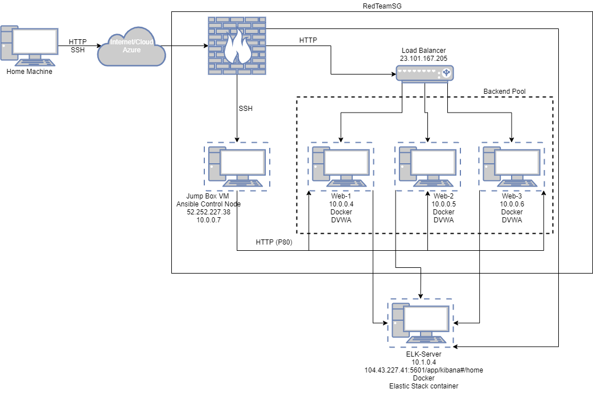
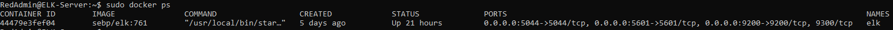

# Project-13

## Automated ELK Stack Deployment

The files in this repository were used to configure the network depicted below.

These files have been tested and used to generate a live ELK deployment on Azure. They can be used to either recreate the entire deployment pictured above. Alternatively, select portions of the playbook files may be used to install only certain pieces of it, such as Filebeat.

This document contains the following details:
- Description of the Topologu
- Access Policies
- ELK Configuration
  - Beats in Use
  - Machines Being Monitored
- How to Use the Ansible Build

### Description of the Topology

The main purpose of this network is to expose a load-balanced and monitored instance of DVWA, the D*mn Vulnerable Web Application.

Load balancing ensures that the application will be highly available, in addition to restricting access to the network.
- The load balancer has an offloading function that protects the server stack from Denial of Service (DoS and DDoS) attacks and also keeps service available in event that one or two of the VM's are unreachable for any reason.
Using the jump box as a provisioner allows us to hide the vulnerable machines with no public IP address and by using ansible and ssh functionality to manage all VM effectively and efficiently at the same time.

Integrating an ELK server allows users to easily monitor the vulnerable VMs for changes to the log and system files.
- Filebeat monitors the log files or locations that you specify, collects log events, and forwards them either to Elasticsearch or Logstash for indexing.
- Metricbeat collects metrics from the operating system and from services running on the server.  In this deployment we are looking at Docker metrics Metricbeat takes the metrics and statistics that it collects and ships them to the output that you specify, such as Elasticsearch or Logstash.

The configuration details of each machine may be found below.

| Name                 | Function   | IP Address | Operating System |
|----------------------|------------|------------|------------------|
| Jump-Box-Provisioner | Gateway    | 10.0.0.7   | Linux            |
| ELK-Server           | Monitoring | 10.1.0.4   | Linux            |
| Web-1                | DVWA       | 10.0.0.4   | Linux            |
| Web-2                | DVWA       | 10.0.0.5   | Linux            |
| Web-3                | DVWA       | 10.0.0.6   | Linux            |

### Access Policies

The machines on the internal network are not exposed to the public Internet.

Only the Jump Box machine can accept connections from the Internet. Access to this machine is only allowed from the following IP addresses:
-my public IP address

Machines within the network can only be accessed by SSH from the Jump Box VM.

- The ELK-Server is accessible using the Jump-Box_Provisioner via SSH from its private IP 10.0.0.7:22

A summary of the access policies in place can be found in the table below.

| Name                 | Publicly Accessible | Allowed IP Address     |
|----------------------|---------------------|------------------------|
| Jump-Box-Provisioner | Yes/SSH             | My public IP address   |
| ELK-Server           | Yes/HTTP            | My public IP address   |
| Web-1                | No                  | 10.0.0.7               |
| Web-2                | No                  | 10.0.0.7               |
| Web-3                | No                  | 10.0.0.7               |

### Elk Configuration

Ansible was used to automate configuration of the ELK machine. No configuration was performed manually, which is advantageous because Ansible allows us to automate the configuration of all client devices simultaneously using playbooks.
The playbook implements the following tasks:
- Install Docker
- Install pip3
- Install docker python module
- Download and launch docker

The following screenshot displays the result of running `docker ps` after successfully configuring the ELK instance.

### Target Machines & Beats
This ELK server is configured to monitor the following machines:

- Virtual Machines Web-1, Web-2 and Web-3
- 10.0.0.4
- 10.0.0.5
- 10.0.0.6

We have installed the following Beats on these machines:
- Filebeat
- Metricbeat

These Beats allow us to collect the following information from each machine:

- Filebeat collects the log files or locations that you specify, collects log events, and forwards them either to Elasticsearch or Logstash for indexing.
- Metricbeat collects metrics from the operating system and from services running on the server.

### Using the Playbook
In order to use the playbook, you will need to have an Ansible control node already configured. Assuming you have such a control node provisioned:

SSH into the control node and follow the steps below:
- Copy the install-ELK.yml playbook file to /etc/ansible/.
- Update the hosts file to include each client VM private IP addresses
    - 10.0.0.4 ansible_python_interpreter=/usr/bin/python3
    - 10.0.0.5 ansible_python_interpreter=/usr/bin/python3
    - 10.0.0.6 ansible_python_interpreter=/usr/bin/python3
    - [elk]
    - 10.1.0.4 ansible_python_interpreter=/usr/bin/python3
- Run the playbook, using the command ansible-playbook install-ELK.yml and navigate to localhost/setup.php on a client to check that the installation worked as expected.

To run the playbook for Filebeat use the command: ansible-playbook filebeat-playbook.yml from /etc/ansible/
To run the playbook for Metricbeat use the command: ansible-playbook metricbeat-playbook.yml from /etc/ansible/
